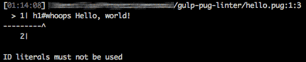

# gulp-pug-linter

Gulp plugin to lint Jade or Pug files

## Status

[](https://nodei.co/npm/gulp-pug-linter/)  
[](https://www.codeship.io/projects/144282)
[](https://coveralls.io/github/ilyakam/gulp-pug-linter?branch=develop)
[](https://david-dm.org/ilyakam/gulp-pug-linter)
[](https://david-dm.org/ilyakam/gulp-pug-linter?type=dev)
[](https://conventionalcommits.org)
[](https://greenkeeper.io/)

## About



A no-frills wrapper for the [`pug-lint`](https://github.com/pugjs/pug-lint/blob/master/README.md) CLI tool. It expects the same configuration files as the CLI. This means that whether you prefer configuring the linter with `.pug-lintrc`, `.pug-lint.json`, `package.json` (`"pugLintConfig": ...`), or even with the legacy `.jade` files, this plugin is going to work for you right out of the box. In addition, it can be set to fail after it encounters lint errors. That's important if you care about making the Continuous Integration (CI) builds fail after error.

## Enterprise Users

This package is available as part of the Tidelift Subscription.

The maintainers of `gulp-pug-linter` and thousands of other packages are working with Tidelift to deliver commercial support and maintenance for the open source dependencies you use to build your applications. Save time, reduce risk, and improve code health, while paying the maintainers of the exact dependencies you use. [Learn more.](https://tidelift.com/subscription/pkg/npm-gulp-pug-linter?utm_source=npm-gulp-pug-linter&utm_medium=referral&utm_campaign=enterprise&utm_term=repo)

## Installation

```sh
$ npm install gulp-pug-linter --save-dev
```

## Options

* `failAfterError` - whether to throw a plugin error after encountering one or more lint errors
* `reporter` - reporter type, name, module, or function to show lint errors

## Usage

### Basic

To lint the template files without breaking the build, pipe the source files into `pugLinter({ reporter: 'default' })`:

```js
// gulpfile.js
const gulp = require('gulp');
const pugLinter = require('gulp-pug-linter');

gulp.task('lint:template', () => (
  gulp
    .src('./**/*.pug')
    .pipe(pugLinter({ reporter: 'default' }))
));
```

Note that specifying a `reporter` key with an invalid value would fall back to the `'default'` reporter and display a warning. The screenshot above shows the `'default'` reporter in action.

### Fail After Error(s)

If you want to break the build after seeing one or more errors, set the `{ failAfterError: true }` option on `pugLinter()`:

```js
// gulpfile.js
const gulp = require('gulp');
const pugLinter = require('gulp-pug-linter');

gulp.task('lint:template', () => (
  gulp
    .src('./**/*.pug')
    .pipe(pugLinter({ failAfterError: true }))
));
```

Note that without a `reporter` option, this usage example would break the build without displaying any lint errors. This might be useful in pre-production CI builds or during a `git bisect`.

### External Reporter

If you want to specify an external module as a reporter, you may provide its constructor:

```js
// gulpfile.js
const gulp = require('gulp');
const pugLinter = require('gulp-pug-linter');
const pugLintStylish = require('puglint-stylish');

gulp.task('lint:template', () => (
  gulp
    .src('./**/*.pug')
    .pipe(pugLinter({ reporter: pugLintStylish }))
));
```

Or you may provide the module's name:

```js
// gulpfile.js
const gulp = require('gulp');
const pugLinter = require('gulp-pug-linter');

gulp.task('lint:template', () => (
  gulp
    .src('./**/*.pug')
    .pipe(pugLinter({ reporter: 'puglint-stylish' }))
));
```

### Custom Reporter

You may define a custom reporter:

```js
// gulpfile.js
const gulp = require('gulp');
const pugLinter = require('gulp-pug-linter');

const myReporter = (errors) => {
  errors.map(error => console.error(error.message));
};

gulp.task('lint:template', () => (
  gulp
    .src('./**/*.pug')
    .pipe(pugLinter({ reporter: myReporter }))
));
```
