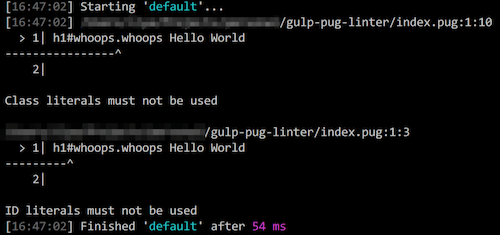

# gulp-pug-linter

Gulp plugin to lint Pug (nee Jade) files

## Status

[](https://nodei.co/npm/gulp-pug-linter/)  
[](https://www.codeship.io/projects/144282)
[](https://coveralls.io/github/ilyakam/gulp-pug-linter?branch=develop)
[](https://david-dm.org/ilyakam/gulp-pug-linter)
[](https://david-dm.org/ilyakam/gulp-pug-linter?type=dev)
[](http://standardjs.com/)
[](https://greenkeeper.io/)

## :warning: Warning :warning:

**Breaking API Changes as of version `1.0.0`:**  
`.reporter()` is being deprecated.

### Migration Guide

#### Built-in Reporter

##### From:

```js
.pipe(pugLinter())
.pipe(pugLinter.reporter())
```

##### To:

```js
.pipe(pugLinter({ reporter: 'default' }))
```

#### Break on Error

##### From:

```js
.pipe(pugLinter())
.pipe(pugLinter.reporter('fail'))
```

##### To:

```js
.pipe(pugLinter({
  failAfterError: true,
  reporter: 'default'
}))
```

#### Custom Reporter

##### From:

```js
.pipe(pugLinter())
.pipe(pugLinter.reporter(myPugLintReporter))
// OR
.pipe(pugLinter.reporter('my-pug-lint-reporter'))
```

##### To:

```js
.pipe(pugLinter({
  failAfterError: true,
  reporter: myPugLintReporter
  // OR
  reporter: 'my-pug-lint-reporter'
}))
```

## About



A no-frills wrapper for the [`pug-lint`](https://github.com/pugjs/pug-lint/blob/master/README.md) CLI. It expects the same configuration files as does the CLI tool. This means that whether you prefer linting from `.pug-lintrc`, `.pug-lint.json`, directly from `package.json` (`"pugLintConfig": ...`), or even the legacy `.jade` files, this plugin is going to work for you right out of the box. In addition, it can be set to fail once it encounters lint errors. That's important if you care about making the Continuous Integration (CI) builds to fail on error.

## Installation

```sh
$ npm install gulp-pug-linter --save-dev
```

## Usage

To see lint errors without breaking the build, simply pipe the Pug source files into `.pugLinter()` and then into the handy, built-in reporter `pugLinter.reporter()`. This is great for watching the `*.pug` files as you're developing them.

```js
// gulpfile.js
var gulp = require('gulp')
var pugLinter = require('gulp-pug-linter')

gulp.task('lint:template', function () {
  return gulp
    .src('./**/*.pug')
    .pipe(pugLinter())
    .pipe(pugLinter.reporter())
})
```

To break the build on lint errors, make sure that `pugLinter.reporter` is set to `'fail'`, like so:

```js
// gulpfile.js
var gulp = require('gulp')
var pugLinter = require('gulp-pug-linter')

gulp.task('lint:template', function () {
  return gulp
    .src('./**/*.pug')
    .pipe(pugLinter())
    .pipe(pugLinter.reporter('fail'))
})
```

Specify external modules as reporters using either the module's
constructor or the module's name:

```js
// gulpfile.js
var gulp = require('gulp')
var pugLinter = require('gulp-pug-linter')
var myPugLintReporter = require('my-pug-lint-reporter')

gulp.task('lint:template', function () {
  return gulp
    .src('./**/*.pug')
    .pipe(pugLinter())
    .pipe(pugLinter.reporter(myPugLintReporter))
})
```

  _- OR -_

```js
// gulpfile.js
var gulp = require('gulp')
var pugLinter = require('gulp-pug-linter')

gulp.task('lint:template', function () {
  return gulp
    .src('./**/*.pug')
    .pipe(pugLinter())
    .pipe(pugLinter.reporter('my-pug-lint-reporter'))
})
```

Specify your own custom reporter:

```js
// gulpfile.js
var gulp = require('gulp')
var pugLinter = require('gulp-pug-linter')

var myReporter = function (errors) {
  if (errors.length) { console.error('It broke!') }
}

gulp.task('lint:template', function () {
  return gulp
    .src('./**/*.pug')
    .pipe(pugLinter())
    .pipe(pugLinter.reporter(myReporter))
})
```
